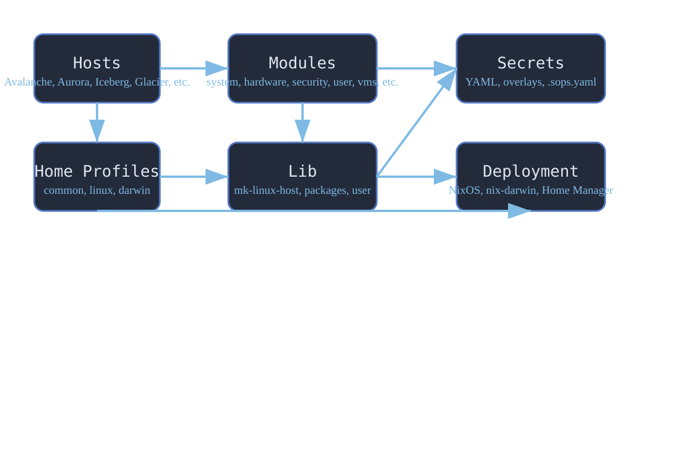
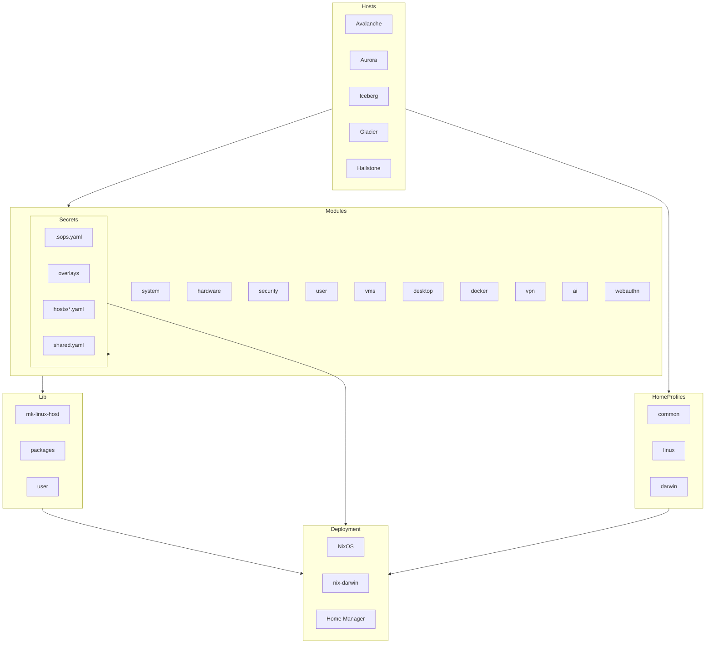

---
title: Architecture
description: Visual and text-based architecture diagram for the Frostflake Nix flake project.
lastUpdated: true
---

# Architecture

---

---

This diagram shows how Frostflake’s hosts, modules, user profiles, lib, secrets, and deployment interact. Each box represents a major part of the repo, and arrows show the flow of configuration and data.

- **Hosts**: Each machine (Avalanche, Aurora, etc.) has its own config and imports modules.
- **Modules**: Reusable building blocks for system, hardware, security, user, VMs, desktop, docker, VPN, AI, secrets, and webauthn.
- **Home Profiles**: User environment overlays for common, Linux, and Darwin.
- **Lib**: Helper functions and shared logic (mk-linux-host, packages, user).
- **Secrets**: Managed via overlays, .sops.yaml, and per-host/shared YAML files.
- **Deployment**: NixOS, nix-darwin, and Home Manager handle system and user environment builds.

> For a visual version, see the SVG above. For a text/diagram version, see the Mermaid chart.
